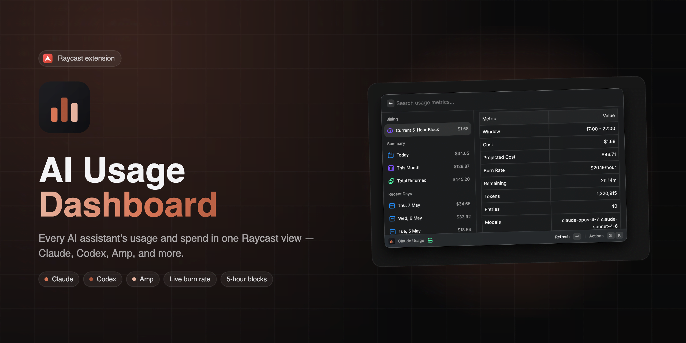

# AI Usage Dashboard

A Raycast extension that tracks your local AI coding usage - tokens, costs, and recent activity - across **Claude Code**, **Codex**, and **AMP**.

## Features

- **Three dashboards** - separate commands for Claude, Codex, and AMP
- **Usage summary** - totals for tokens and cost
- **Recent days** - daily breakdown of activity
- **Billing block** (Claude) - current 5-hour billing window status
- **Offline-friendly** - query results are cached locally

## Commands

| Command        | Description                       |
| -------------- | --------------------------------- |
| `Claude Usage` | Show Claude Code usage statistics |
| `Codex Usage`  | Show Codex usage statistics       |
| `AMP Usage`    | Show AMP usage statistics         |

## License

MIT
