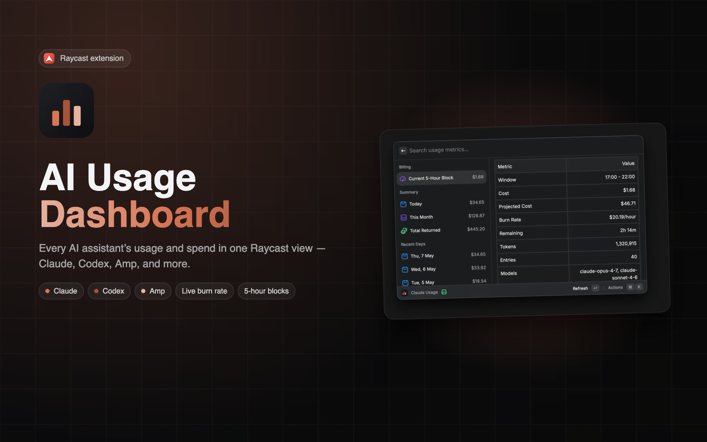

# AI Costs Dashboard

A Raycast extension that tracks your local AI coding spend — daily costs, totals, and recent activity — across **Claude Code**, **Codex**, and **AMP**.

## Features

- **Three dashboards** - separate commands for Claude, Codex, and AMP
- **Cost summary** - totals for spend and tokens
- **Recent days** - daily cost breakdown
- **Billing block** (Claude) - current 5-hour billing window status
- **Offline-friendly** - query results are cached locally

## Commands

| Command        | Description                                |
| -------------- | ------------------------------------------ |
| `Claude Costs` | Show Claude Code spending and billing block |
| `Codex Costs`  | Show Codex spending and daily totals        |
| `AMP Costs`    | Show AMP spending and daily totals          |

## License

MIT
